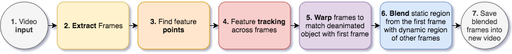

Cinemagraph
==============

## Synopsis

Cinemagraph is partially de-animated video that creates a dramatic effect of freezing part of the video creating a hybrid of photo and video. 

In this project I'm using the techniques described in [Selectively De-Animating Video (Jiamin Bai, Aseem Agarwala, Maneesh Agrawala, Ravi Ramamoorthi](http://graphics.berkeley.edu/papers/Bai-SDV-2012-08/) paper as well as some other computater vision methods to make my own pipeline for generating cinemagraph from video.

## Results

I used to example videos and de-animated them in a way to create an illusion of the self-moving objects.

### Glass of water

In the first video I'm rapidly moving glass of water sideways. In this example I de-animated everyting except the water in the glass itself. As the results it seems as if water is moving inside glass on its own without any reason.

Original: [YouTube :movie_camera:](https://youtu.be/gHL4WiJnB40) 

Result:   [YouTube :movie_camera:](https://youtu.be/kE1zf_hruRI)

### Foosball

Second example demonstrates game of two foosball players. After the conversion the foosball table is playing on its own with players frozen in shock.

Original: [YouTube :movie_camera:](https://youtu.be/AGpKgMAi5FA) 

Result:   [YouTube :movie_camera:](https://youtu.be/GLGEVXxhoMI)

## Code

 - *main.py*: executes pipeline
 - *pipeline.py*: contains all the methods of the pipeline
 - *video_processor.py*: extracts frames from the video and saves frames sequence to video
 - *glass.ipynb, foosball.ipynb*: Jupyter notebooks that prepare inputs for processing and runs the pipeline.

## Resources

Example inputs can be downloaded from [Google Drive](https://drive.google.com/open?id=1NH1AoIqSSATSEkxCI3gWjf5cXnNwO0)

## Report

For more detailed explanation of the project, process, results and code please see the [Report](report.pdf)

